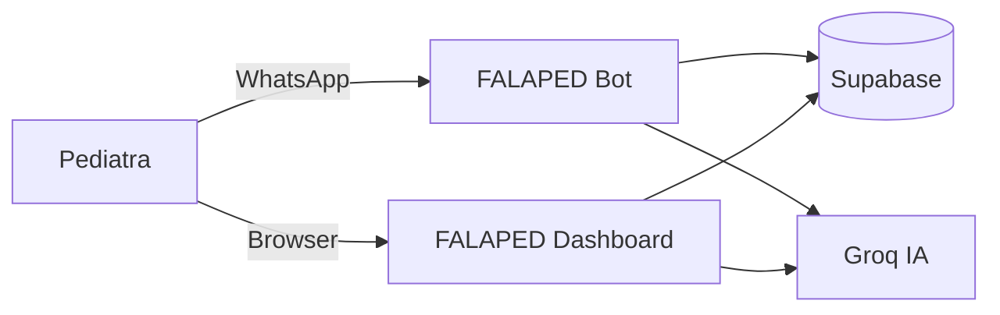
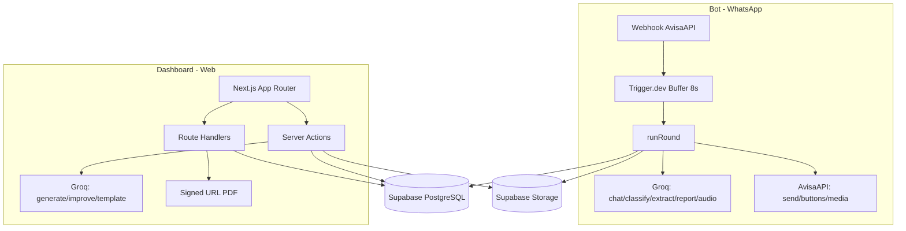

# FALAPED — Analise Completa do Produto

Documento unico consolidado que integra as analises do **FALAPED Bot** (assistente WhatsApp) e do **FALAPED Dashboard** (plataforma web) em uma visao completa do produto SaaS.

> Referencia de detalhe por pilar:
> - Bot: [`docs/analise-falaped-bot/`](analise-falaped-bot/)
> - Dashboard: [`docs/analise-falaped/`](analise-falaped/)

---

## Sumario

1. [Visao geral do produto](#1-visao-geral-do-produto)
2. [Problema, oportunidade e tese de negocio](#2-problema-oportunidade-e-tese-de-negocio)
3. [Publico-alvo, personas e ICP](#3-publico-alvo-personas-e-icp)
4. [Analise de concorrentes e posicionamento](#4-analise-de-concorrentes-e-posicionamento)
5. [Modelo de monetizacao e pricing](#5-modelo-de-monetizacao-e-pricing)
6. [Go-to-market e metricas de crescimento](#6-go-to-market-e-metricas-de-crescimento)
7. [Escopo funcional do produto](#7-escopo-funcional-do-produto)
8. [Arquitetura tecnica e stack](#8-arquitetura-tecnica-e-stack)
9. [Seguranca, performance e confiabilidade](#9-seguranca-performance-e-confiabilidade)
10. [Deploy e especificacoes de canal](#10-deploy-e-especificacoes-de-canal)
11. [Riscos, dependencias e decisoes](#11-riscos-dependencias-e-decisoes)
12. [Cronograma e roadmap](#12-cronograma-e-roadmap)

---

## 1. Visao geral do produto

### Visao

O FALAPED e uma plataforma de produtividade clinica para pediatras que atendem por WhatsApp. Combina um **assistente operacional nativo no WhatsApp** (bot) com um **dashboard web de gestao** (dashboard), conectados a uma base de dados unica, para estruturar atendimentos em fluxos de caso e discussao, preservar contexto clinico e gerar documentacao medica de forma rapida.

### Proposta de valor

Menos tempo administrativo e mais continuidade clinica. O pediatra organiza casos, gera relatorios com IA, emite receitas e atestados — tudo a partir da conversa no WhatsApp ou do painel web — sem trocar de ferramenta.

### Como o pediatra interage com o FALAPED



| Canal | Papel no produto | Estado |
|---|---|---|
| **WhatsApp (Bot)** | Operacao clinica diaria: caso, discussao, relatorio PDF, comandos guiados | Implementado |
| **Dashboard Web** | Gestao completa: casos, pacientes, relatorio por secoes com IA, receitas, atestados, templates | Implementado |
| **App externo (app.falaped)** | Camada complementar de gestao web | Complementar |

Os dois canais compartilham o mesmo banco (Supabase), os mesmos perfis (`profiles`), os mesmos casos e pacientes. Um caso iniciado no WhatsApp aparece no dashboard; um relatorio gerado no dashboard pode ser referenciado no bot.

---

## 2. Problema, oportunidade e tese de negocio

### Problema

| Problema | Impacto na operacao | Consequencia de negocio |
|---|---|---|
| Conversas clinicas em canal informal (WhatsApp) | Informacao dispersa e sem estrutura | Baixa escalabilidade do medico |
| Documentacao manual (relatorio/receita/atestado) | Tempo alto por atendimento | Menor capacidade de atendimentos por dia |
| Falta de rastreabilidade por caso e paciente | Risco de perda de contexto clinico | Queda de qualidade percebida e risco juridico |
| Ferramentas generalistas de clinica | Fluxo pouco aderente ao pediatra digital-first | Adocao parcial e churn |
| Contexto fragmentado entre conversas | Retrabalho e perda de continuidade | Agenda comprometida e qualidade de seguimento reduzida |

### Oportunidade

- Especializacao vertical em pediatria com foco em "atendimento por conversa".
- Diferenciacao por fluxo WhatsApp-first + producao automatizada de documento clinico.
- Produto orientado a produtividade medica com monetizacao recorrente SaaS.
- No Brasil, WhatsApp ja e canal de trabalho do medico — a estrategia WhatsApp-first reduz friccao de adocao.

### Tese de negocio

Se o pediatra reduzir tempo administrativo por caso e aumentar previsibilidade do registro clinico, ele aumenta capacidade de atendimento sem ampliar proporcionalmente custo fixo da operacao.

### Motores de valor

| Motor | Mecanismo no FALAPED | Resultado esperado |
|---|---|---|
| Produtividade | IA para relatorio por secao + templates + reuso de dados | Menos tempo por caso |
| Padronizacao | Estrutura unica por caso/paciente/documento | Melhor consistencia de qualidade |
| Receita indireta | Mais capacidade da agenda e menor atraso de documentacao | Mais atendimentos faturaveis |
| Retencao | Alto custo de troca (historico + templates + fluxo operacional) | Menor churn mensal |

### ROI (modelo de referencia)

**Formula:** `ROI mensal (%) = ((ganho_de_produtividade + ganho_de_receita - custo_saas) / custo_saas) * 100`

| Segmento | Hipotese de ganho de tempo | Valor economico mensal estimado | Ticket sugerido |
|---|---|---|---|
| Pediatra solo | 20-40 min/dia util (7-14 horas/mes) | R$ 1.750 a R$ 5.000/mes | R$ 149-R$ 249 |
| Clinica pequena (2-5 pediatras) | Ganho agregado por padronizacao | 15-40 horas/mes agregadas (time) | R$ 599-R$ 899 |

Premissas: produto usado no fluxo real de caso/discussao; valor medido por tempo recuperado e reducao de retrabalho; ROI depende de ativacao continua.

### North Star Metric

**Casos finalizados com documentacao completa por medico/mes**

### KPIs de negocio e produto

| Pilar | KPI | Formula / Definicao | Meta inicial |
|---|---|---|---|
| Aquisicao | Novos medicos ativados/mes | contas novas com onboarding concluido | >=20 apos beta |
| Ativacao | Inicio de caso/discussao em 7 dias | `usuarios_com_caso_7d / novos_usuarios` | >=70% |
| Ativacao | Conversao cadastro -> vinculacao WhatsApp | `contas_vinculadas / contas_cadastradas` | >=70% |
| Engajamento | Casos/discussoes por usuario/semana | interacoes estruturadas | >=3/semana |
| Engajamento | Adocao de relatorio IA | `casos_com_relatorio / casos_totais` | >=60% |
| Engajamento | Adocao de documentos clinicos | `(receitas + atestados) / casos_totais` | >=35% |
| Retencao | Retencao D30 | `usuarios_ativos_D30 / cohort` | >=55% |
| Retencao | Retencao de MRR | `MRR_fim / MRR_inicio (mesma base)` | >=90% |
| Monetizacao | Conversao para pago | `contas_paid / contas_vinculadas` | >=25-35% |
| Valor percebido | Tempo economizado percebido | pesquisa qualitativa | >=70% relatam ganho |

### Criterios de sucesso

- O medico percebe valor em ate 7 dias de uso.
- O produto sustenta cobranca recorrente sem suporte operacional desproporcional.
- A narrativa comercial principal e "menos trabalho administrativo e mais continuidade clinica", nao "IA por IA".

---

## 3. Publico-alvo, personas e ICP

**Regra de produto:** o usuario final e sempre medico/pediatra. Nao ha uso por pais/responsaveis.

### ICP (Ideal Customer Profile)

#### ICP primario (go-to-market inicial)

| Dimensao | Definicao |
|---|---|
| Tipo de cliente | Pediatra solo ou clinica pequena (ate 5-10 pediatras) |
| Geografia | Capitais e regioes metropolitanas do Brasil |
| Maturidade digital | Usa WhatsApp como canal principal de rotina clinica |
| Dor principal | Sobrecarga de comunicacao e documentacao |
| Decisao de compra | Rapida, low-touch assistido |
| Ticket aderente | Ate R$ 300/medico/mes |

#### ICP secundario (expansao)

| Dimensao | Definicao |
|---|---|
| Segmento | Clinica multiprofissional com celula de pediatria |
| Dor | Falta de padrao de documentacao pediatrica |
| Potencial | Venda por volume e maior ARPA |
| Horizonte | Apos prova de retencao e monetizacao no ICP atual |

### Personas

| Persona | Perfil | Dores | Jobs to be done | Canal principal | Resultado esperado |
|---|---|---|---|---|---|
| **Pediatra solo** (principal) | 1 medico, agenda cheia, pouca equipe | Perda de contexto, retrabalho, tempo para relatorio | Organizar conversa clinica, encerrar/retomar caso, gerar relatorio rapido | WhatsApp + Dashboard | Reduzir carga administrativa diaria |
| **Coordenador clinico** (decisor) | Clinica pequena, 2-5 pediatras | Padrao inconsistente, visao fragmentada | Padronizar operacao e acompanhar uso do time | Dashboard | Eficiencia e menos ruido operacional |
| **Pediatra associado** (secundario) | Atua em clinica com fluxo misto | Precisa rapidez sem curva longa | Usar comandos claros e manter continuidade do caso | WhatsApp | Atendimento mais fluido |
| **Secretaria/operacao** (influenciadora) | Apoio administrativo | Falta de rastreabilidade de status | Localizar, baixar e enviar documentos | Dashboard | Menos follow-up manual |

---

## 4. Analise de concorrentes e posicionamento

### Leitura estrategica

O FALAPED nao compete somente com prontuario/agenda generalista. Ele compete por "produtividade clinica em atendimentos conversacionais", especialmente em pediatria. Nao deve disputar espaco como ERP clinico completo; deve se posicionar como assistente operacional do pediatra no canal onde ele ja trabalha.

### Mapa competitivo

| Grupo | Exemplos | Forca principal | Lacuna para FALAPED explorar |
|---|---|---|---|
| Bot de clinica/secretaria | CPBot, Iara, Auraclin | Automacao de atendimento e agenda | Foco menor no workflow clinico do pediatra |
| Suite clinica/prontuario | iClinic, Feegow, Conclinica, Easy Clinic, Ninsaude | Escopo amplo (ERP + prontuario) | Maior complexidade para consultorio enxuto |
| Assistente WhatsApp internacional | Medivice, AwaDoc | Experiencia conversacional | Menor aderencia ao contexto local BR e jornada pediatrica |
| Marketplace + agenda | Doctoralia Pro | Canal de descoberta e agendamento | Nao focado em caso clinico via WhatsApp |

### Comparativo estrategico

| Criterio | FALAPED | iClinic | Feegow | Doctoralia Pro | Ninsaude |
|---|---|---|---|---|---|
| Foco principal | Fluxo pediatrico WhatsApp-first | Gestao geral de consultorio | ERP clinico completo | Captacao + agenda | Gestao para clinicas |
| Profundidade em "caso por conversa" | Alta | Baixa/Media | Baixa/Media | Baixa | Baixa/Media |
| IA aplicada ao relatorio por secao | Sim | Nao explicito no core | IA em prontuario (amplo) | IA em notas | Nao explicito |
| Especializacao pediatrica | Alta | Media | Media | Baixa/Media | Media |
| Modelo de compra | SaaS por medico | SaaS por medico | SaaS por medico | Plano + plataforma | SaaS clinico |

### Diferencial competitivo

| Eixo | Posicionamento FALAPED |
|---|---|
| Vertical | Pediatria (nao horizontal para todas especialidades) |
| Canal | WhatsApp-first com camada web complementar |
| Valor | Organizacao operacional + documentacao clinica mais rapida |
| Adocao | Baixo atrito para medico que ja trabalha no WhatsApp |

### Posicionamento consolidado

**"Assistente operacional com IA para pediatras, nativo no WhatsApp, com dashboard web para gestao de casos, pacientes e documentos clinicos."**

### Pilares de mensagem

| Pilar | Prova no produto |
|---|---|
| Velocidade | Geracao de relatorio por IA, templates, comandos rapidos no WhatsApp |
| Organizacao | Caso, paciente e documentos no mesmo fluxo (bot + dashboard) |
| Confianca | Ownership por profile e downloads por signed URL |
| Especializacao | Linguagem e jornada centradas em pediatria |

---

## 5. Modelo de monetizacao e pricing

### Estrutura B2B2C

| Camada | Papel no modelo |
|---|---|
| **B2B** (cliente pagante) | Pediatra ou clinica contrata assinatura mensal |
| **B2C** (beneficiario indireto) | Responsavel da crianca recebe melhor experiencia e tempo de resposta |
| **Plataforma** | Coordena dados, workflow e documentos (caso -> paciente -> relatorio/receita/atestado) |
| **Expansao** | Upsell de solo para clinica pequena (assentos e gestao) |

### Tabela de planos consolidada

| Plano | Faixa de preco | ICP alvo | Objetivo |
|---|---|---|---|
| Beta Founder Solo | R$ 149-R$ 199/mes | Pediatra solo (beta) | Validar conversao e retencao |
| Solo Standard | R$ 249/mes | Pediatra solo (uso continuo) | Consolidar unidade economica |
| Clinica Pequena | R$ 599-R$ 899/mes | 2-5 pediatras | Capturar valor de time |
| Clinica (volume) | Sob proposta | 5+ medicos | Expandir MRR em contas B2B |

### Benchmark de mercado

| Produto | Faixa publica | Unidade |
|---|---|---|
| iClinic | R$ 99 a R$ 299 | por profissional/mes |
| Feegow | R$ 129 a R$ 249 | por profissional/mes |
| Doctoralia Pro | Nao publico | sob demonstracao |
| Ninsaude | Sob consulta | proposta comercial |

### Principios de pricing

| Principio | Aplicacao |
|---|---|
| Sem freemium amplo no inicio | Evita custo alto de suporte sem receita |
| Trial curto ou beta assistido | Acelera prova de valor |
| Poucos planos no lancamento | Reduz friccao comercial |
| Venda por beneficio operacional | Ancora em tempo economizado e continuidade |
| Desconto para ciclo semestral/anual | Melhora caixa e reduz churn |

---

## 6. Go-to-market e metricas de crescimento

### Hipotese central de mercado

O FALAPED nao deve disputar espaco como ERP clinico completo; deve se posicionar como assistente operacional do pediatra no canal onde ele ja trabalha, com ganho rapido e comprovavel de tempo.

### Funil unico

```
Lead -> Cadastro -> Vinculacao WhatsApp (bot) -> Primeiro caso/discussao -> Primeiro relatorio -> Pago -> Retencao
```

### Canais prioritarios

| Prioridade | Canal | Objetivo |
|---|---|---|
| 1 | Base beta atual (10 pediatras) | Gerar prova de ativacao e retencao |
| 2 | Indicacao entre pediatras | Crescimento com CAC menor |
| 3 | Conteudo de produtividade medica | Atrair ICP qualificado |
| 4 | Parcerias leves (comunidades e eventos nichados) | Acelerar alcance regional |

### Mensagens-chave

| Mensagem | Uso |
|---|---|
| "Organize seus casos e gere relatorios mais rapido, sem sair do WhatsApp." | Topo e meio de funil |
| "Menos retrabalho administrativo, mais continuidade no cuidado." | Prova de valor e conversao |
| "Feito para pediatras e clinicas pequenas, sem complexidade de suite pesada." | Comparacao competitiva |

### TAM/SAM/SOM (Brasil)

**Premissas:**

| Premissa | Valor de referencia |
|---|---|
| Pediatras no Brasil | ~40.000 a 50.000 profissionais |
| Perfil solo/clinica pequena | 50% a 65% |
| Ticket anual medio | R$ 2.400 a R$ 5.000 por conta/ano |

**Estimativas:**

| Camada | Definicao | Faixa estimada |
|---|---|---|
| TAM | Mercado total de pediatras com potencial de software vertical | R$ 115M a R$ 250M/ano |
| SAM | Solo + clinica pequena com WhatsApp ativo | R$ 60M a R$ 150M/ano (30-50% TAM) |
| SOM (24 meses) | Parcela capturavel no ciclo inicial | R$ 0,6M a R$ 3,0M/ano (0,5-2% SAM) |

Foco: profundidade no SAM, nao expansao horizontal precoce.

### KPIs de marketing e crescimento

| Pilar | KPI | Meta inicial |
|---|---|---|
| Aquisicao | Leads ICP qualificados/mes | >=50 apos consolidar beta |
| Ativacao | % novos usuarios com caso/discussao em 7 dias | >=70% |
| Conversao | % beta -> pago | >=35% |
| Retencao | Retencao D30 do cohort pago | >=55% |
| Receita | MRR de contas ativas | Crescimento mensal sustentado |
| Eficiencia | CAC payback | <=6 meses no segmento solo |
| Churn | MRR cancelado / MRR inicio mes | <=5% ao mes |
| ARPA | MRR / contas pagas | Crescente por planos superiores |

### Requisitos de marketing para o proximo ciclo

| ID | Requisito | Prioridade |
|---|---|---|
| MKT-01 | Criar narrativa unica de categoria: assistente operacional pediatrico WhatsApp-first | Alta |
| MKT-02 | Definir landing page com proposta WhatsApp-first para pediatras | Alta |
| MKT-03 | Instrumentar funil completo (lead -> ativacao -> pago -> retencao) | Alta |
| MKT-04 | Criar calculadora de ROI simples para pre-venda | Alta |
| MKT-05 | Publicar casos de uso reais do beta com metricas de tempo economizado | Media |
| MKT-06 | Rodar experimento de preco por cohort (Founder vs Standard) | Media |
| MKT-07 | Definir playbook de onboarding de 15-20 minutos para reduzir churn | Media |

---

## 7. Escopo funcional do produto

### Funcionalidades por canal

| Feature | Bot | Dashboard | Prioridade |
|---|---|---|---|
| Login e sessao segura | — | Sim | Must |
| Vinculacao WhatsApp (codigo 6 digitos) | Sim (valida codigo) | Sim (gera codigo) | Must |
| Iniciar caso com dados do paciente | Sim | Sim (listagem/detalhe) | Must |
| Iniciar discussao clinica | Sim | Sim (listagem) | Must |
| Chat contextualizado (caso/discussao) | Sim | Sim (visualizar mensagens) | Must |
| Cadastro/associacao de paciente | Sim (no inicio do caso) | Sim (CRUD completo) | Must |
| Gerar relatorio do atendimento (IA) | Sim (PDF via WhatsApp) | Sim (por secoes + edicao) | Must |
| Finalizar relatorio | — | Sim (bloquear edicao) | Must |
| Ownership e controle de acesso | Sim (por telefone/profile) | Sim (por profile_id) | Must |
| Confiabilidade do chat com fallback | Sim | — | Must |
| Confirmacao de relatorio antes de sobrescrever | Sim | — | Must |
| Templates de relatorio (CRUD + IA) | — | Sim | Should |
| Melhorar secao com IA | — | Sim | Should |
| Receitas com PDF | — | Sim | Should |
| Atestados com PDF | — | Sim | Should |
| Filtros e busca em listagens | — | Sim | Should |
| Comandos contextuais (lista guiada) | Sim | — | Should |
| Reabrir caso/discussao (lista guiada) | Sim | — | Should |
| Dashboard analitico de produtividade | — | Futuro | Could |
| Midia e documentos adicionais | Futuro | — | Could |
| Cache Redis em queries chave | Futuro | — | Could |
| App mobile nativo completo | — | Futuro | Won't (agora) |
| Suporte para pais/responsaveis | — | — | Won't |
| Faturamento TISS completo | — | — | Won't |

### User flows principais

#### Fluxo 1 — Primeiro uso (ativacao)

1. Pediatra cria conta no dashboard (email/senha).
2. Sessao validada server-side.
3. Dashboard direciona para vincular WhatsApp.
4. Gera codigo de 6 digitos e envia ao bot via WhatsApp.
5. Bot valida codigo nao expirado e vincula telefone ao profile.
6. Pediatra retorna ao dashboard com conta vinculada.

#### Fluxo 2 — Caso no WhatsApp (bot)

1. Medico envia mensagem; bot oferece botoes de inicio.
2. Escolhe "Iniciar Caso"; sistema pede dados do paciente.
3. Envia dados completos; sistema cria paciente/caso e confirma.
4. Segue conversa clinica com respostas contextualizadas.
5. Solicita relatorio; sistema gera PDF e envia no WhatsApp.

#### Fluxo 3 — Caso no Dashboard (web)

1. Pediatra abre lista de casos (ativos primeiro).
2. Entra no detalhe e visualiza conversa/mensagens.
3. Associa paciente existente ou cria paciente.
4. Gera relatorio por secoes via IA.
5. Edita secoes e finaliza relatorio.
6. Opcionalmente gera receita e/ou atestado com PDF.

#### Fluxo 4 — Discussao clinica (bot)

1. Medico escolhe "Iniciar Discussao".
2. Envia duvida clinica; chat responde no contexto de discussao.
3. Finaliza ou reinicia ao terminar.

#### Fluxo 5 — Reabertura (bot)

1. Medico escolhe reabrir no menu.
2. Sistema lista casos/discussoes fechados.
3. Seleciona item numerado; sistema reabre e confirma.

#### Fluxo 6 — Templates (dashboard)

1. Acessa templates de relatorio.
2. Cria manualmente ou gera estrutura por IA.
3. Define template ativo para proximos casos.

### Requisitos funcionais consolidados

#### Bot

| ID | Requisito |
|---|---|
| FR-01 | O sistema deve receber webhook da AvisaAPI e normalizar payload de texto/audio. |
| FR-02 | O sistema deve enfileirar eventos por telefone com janela de buffer de 8s. |
| FR-03 | O sistema deve autenticar usuario por telefone e tratar estados lead/unpaid/blocked/paid. |
| FR-04 | O sistema deve suportar dois modos de conversa: caso e discussao. |
| FR-05 | O sistema deve exigir dados obrigatorios de paciente para iniciar caso. |
| FR-06 | O sistema deve gerar resposta de chat contextualizada ao fluxo ativo. |
| FR-07 | O sistema deve suportar geracao de relatorio PDF com template. |
| FR-08 | O sistema deve tratar confirmacoes de relatorio existente antes de sobrescrever. |
| FR-09 | O sistema deve permitir reabertura de caso/discussao fechados. |
| FR-10 | O sistema deve disponibilizar comandos contextuais para orientar o usuario. |

#### Dashboard

| ID | Requisito | Prioridade |
|---|---|---|
| RF-01 | O sistema deve autenticar usuarios por email/senha. | Must |
| RF-02 | O sistema deve validar sessao em rotas protegidas. | Must |
| RF-03 | O usuario deve conseguir vincular WhatsApp via codigo temporario. | Must |
| RF-04 | O sistema deve listar casos por profile e status. | Must |
| RF-05 | O usuario deve visualizar detalhe do caso com mensagens. | Must |
| RF-06 | O usuario deve associar/desassociar paciente do caso. | Must |
| RF-07 | O sistema deve gerar relatorio por secoes com IA. | Must |
| RF-08 | O usuario deve editar, reordenar e finalizar relatorio. | Must |
| RF-09 | O usuario deve cadastrar/editar/excluir pacientes. | Must |
| RF-10 | O usuario deve gerar receitas com PDF em storage. | Should |
| RF-11 | O usuario deve gerar atestados com PDF em storage. | Should |
| RF-12 | O usuario deve gerenciar templates de relatorio e receita. | Should |
| RF-13 | O sistema deve permitir busca/filtro em listagens principais. | Should |

### Requisitos nao-funcionais consolidados

| ID | Requisito | Meta/Contexto |
|---|---|---|
| RNF-01 | Seguranca de acesso por ownership (`profile_id`) | 100% das operacoes sensiveis protegidas |
| RNF-02 | Disponibilidade em ambiente web responsivo | Desktop e mobile browser |
| RNF-03 | Tempo de resposta em fluxos criticos (dashboard) | p95 < 2s em leitura |
| RNF-04 | Auditoria minima de erros | Logs em falhas de modulos e APIs |
| RNF-05 | Integridade de dados clinicos | Validacao de entrada e schema consistente |
| RNF-06 | Idioma da UX | PT-BR em interface e mensagens |
| RNF-07 | Confiabilidade: idempotencia por `(phone, external_message_id)` | Bot: sem duplicidade de resposta |
| RNF-08 | Performance: janela de buffer 8s sem backlog crescente | Bot: processamento previsivel |
| RNF-09 | Observabilidade: logs estruturados por modulo | Bot: Avisa, Orchestrator, Groq, Supabase |
| RNF-10 | Escalabilidade: arquitetura modular por dominio | Bot + Dashboard: evolucao incremental |
| RNF-11 | UX: copy clara e acao guiada por botoes | Bot: sempre que possivel |

### Criterios de aceitacao (por macro-feature)

#### Vinculacao WhatsApp

- Dado usuario autenticado sem vinculacao, quando gera codigo valido e envia ao bot dentro do prazo, entao o status de vinculacao e atualizado e o acesso e liberado.

#### Caso/Discussao (bot)

- Dado que nao ha conversa ativa, quando o medico iniciar interacao, entao deve receber opcoes claras de fluxo.
- Dado que o medico inicia caso, quando dados obrigatorios do paciente forem enviados, entao o caso deve ser criado com `patient_id`.
- Dado que o medico inicia discussao, quando enviar mensagens clinicas, entao o sistema deve responder no contexto de discussao.

#### Relatorio do atendimento

- Dado caso com mensagens e template efetivo, quando o usuario clica em gerar relatorio (dashboard), entao o sistema cria secoes preenchidas e persiste o relatorio associado ao caso.
- Dado que ha historico minimo, quando o medico solicitar relatorio (bot), entao o sistema gera PDF e envia no WhatsApp.
- Dado que ja existe relatorio WhatsApp, quando o medico escolher "nao, manter atual", entao o sistema reenvia o PDF existente.

#### Finalizar relatorio (dashboard)

- Dado relatorio em edicao, quando o usuario marca "finalizar edicao", entao campos ficam bloqueados e `is_finalized` e persistido.

#### Documentos PDF (dashboard)

- Dado usuario autenticado e owner, quando solicita download de receita ou atestado, entao API retorna signed URL valida e temporaria.

#### Fallback de erro (bot)

- Dado erro de LLM no chat, quando a excecao ocorrer, entao o usuario recebe mensagem de fallback (sem silencio).

#### Reabertura (bot)

- Dado que existem casos/discussoes fechados, quando o medico pedir reabertura, entao o sistema lista opcoes e reabre o item escolhido.

---

## 8. Arquitetura tecnica e stack

### Stack unificada

| Camada | Tecnologia | Uso | Pilar |
|---|---|---|---|
| Runtime | Node.js 22 | Execucao server-side | Ambos |
| Framework | Next.js 16 + React 19 + TypeScript 5 | Pages, API routes, interfaces | Ambos |
| UI Web (dashboard) | Tailwind CSS + Shadcn/Radix | Componentes reutilizaveis, tema por tokens | Dashboard |
| UI Web (bot) | Tailwind CSS + React Flow | Monitoramento e diagrama | Bot |
| Backend BaaS | Supabase (Auth, Postgres, Storage) | Autenticacao, dados clinicos, PDFs | Ambos |
| IA | Groq SDK | Geracao/melhoria de texto, chat, classificacao, extracao, transcricao | Ambos |
| Mensageria WhatsApp | AvisaAPI | Entrada/saida de mensagens WhatsApp | Bot |
| Jobs assincronos | Trigger.dev v4 | Buffer de 8s por telefone | Bot |
| Validacao | Zod + react-hook-form | Validacao de entrada e formularios | Ambos |
| PDF | pdfkit | Geracao de receitas e atestados | Dashboard |

### Diagrama de arquitetura



### Componentes logicos

#### Bot

| Bloco | Responsabilidade |
|---|---|
| `app/api/webhooks/avisa` | Entrada HTTP do webhook; delegacao ao orchestrator |
| `modules/orchestrator` | Fluxo principal por rodada (`runRound`): auth -> context -> confirmacoes -> intent -> route -> chat |
| `modules/avisa` | Cliente e envio de mensagens/botoes/documentos |
| `modules/groq` | Operacoes LLM por dominio (chat, classify, extract, report, audio) |
| `modules/supabase` | Queries por dominio com tipagem |
| `lib/` | Utilitarios transversais (copy, env, parser, pdf, logger) |

#### Dashboard

| Bloco | Responsabilidade |
|---|---|
| `app/` | Rotas e pages (auth, dashboard, api) |
| `components/` | UI primitives (Shadcn) e feature components |
| `modules/` | Regras de negocio + queries Supabase por dominio |
| `actions/` | Server Actions por contexto funcional |
| `lib/supabase` | Clients browser/server/proxy de sessao |

### Schema compartilhado (Supabase)

| Dominio | Tabelas | Quem le | Quem escreve |
|---|---|---|---|
| Identidade e perfil | `profiles`, `authenticated_users`, `phone_link_codes` | Bot + Dashboard | Bot + Dashboard |
| Atendimento | `cases`, `case_messages`, `case_reports` | Bot + Dashboard | Bot + Dashboard |
| Pacientes | `patients` | Bot + Dashboard | Bot + Dashboard |
| Documentos | `prescriptions`, `prescription_templates`, `medical_certificates`, `report_templates` | Dashboard | Dashboard |
| Conversas livres | `discussions`, `discussion_messages` | Bot + Dashboard | Bot + Dashboard |
| Operacional (bot) | `incoming_webhook_events`, `trigger_buffer_runs`, `leads` | Bot | Bot |

### Relacionamentos criticos

| Relacao | Proposito |
|---|---|
| `profiles` -> `cases`/`discussions` | Isolamento de dados por medico |
| `cases` -> `patients` | Associar atendimento ao paciente |
| `cases` -> `case_messages` | Historico cronologico 1:N |
| `cases` -> `case_reports` | Relatorios por caso (source whatsapp/web) |
| `discussions` -> `discussion_messages` | Historico 1:N para discussao |
| `profiles` -> `prescriptions`/`medical_certificates` | Ownership de documentos |
| `profiles` -> `report_templates` | Customizacao por medico/clinica |

### Constraints e garantias

| Item | Garantia |
|---|---|
| Idempotencia de webhook | Unique `(phone, external_message_id)` em `incoming_webhook_events` |
| Busca de caso/discussao ativos | Indices por `profile_id + status` |
| Vinculacao de numero | Trigger sincroniza `linked_phone_status` apos uso de link code |
| Armazenamento de PDF | Bucket `report-pdfs` no Supabase Storage |

Fonte oficial de modelagem: `docs/tipagens/modelagem/` (README, arquivos por tabela, enums, triggers, functions).

### APIs e integracoes

#### Bot — APIs internas

| Endpoint | Metodo | Objetivo | Autenticacao |
|---|---|---|---|
| `/api/health` | GET | Health check | Publica |
| `/api/webhooks/avisa` | POST | Receber eventos do WhatsApp | Validacao por payload |
| `/api/jobs/process-buffer` | POST | Processar lote apos janela | Bearer `PROCESS_BUFFER_SECRET` |

#### Bot — Integracao AvisaAPI

| Funcao | Uso |
|---|---|
| `sendMessage` | Envio de texto |
| `sendButtons` | Envio de opcoes guiadas |
| `sendMedia/sendDocument` | Envio de PDF e arquivos |
| `markReadMessage` | UX de leitura |
| `chatTyping` | UX de digitando |

#### Bot — Integracao Groq

| Dominio | Funcao | Modelo de referencia |
|---|---|---|
| Chat | `chatPediatrics` | `openai/gpt-oss-120b` |
| Classificacao | route/intent classifiers | modelos 8b/70b |
| Extracao | dados de paciente | `llama-3.3-70b-versatile` |
| Relatorio | geracao e revisao PT-BR | `openai/gpt-oss-120b` |
| Audio | transcricao | `whisper-large-v3` |

#### Bot — Integracao Trigger.dev

| Processo | Descricao |
|---|---|
| Janela de buffer | 8 segundos por telefone |
| Reschedule | Nova mensagem no mesmo phone reprograma run |
| Processamento | Job chama `runRound` com eventos agregados |

#### Dashboard — APIs internas (Route Handlers)

| Rota | Metodo | Objetivo | Seguranca |
|---|---|---|---|
| `/api/prescriptions/[id]/download` | GET | Signed URL de receita | Auth + ownership por `profile_id` |
| `/api/medical-certificates/[id]/download` | GET | Signed URL de atestado | Auth + ownership por `profile_id` |

#### Dashboard — Integracao Groq

| Endpoint logico | Funcao |
|---|---|
| `generate-case-report` | Gerar conteudo inicial do relatorio por secoes |
| `improve-report-section` | Melhorar redacao de secao especifica |
| `generate-report-template-sections` | Sugerir estrutura de template por IA |

### Contrato de autenticacao e sessao

| Item | Web (Dashboard) | WhatsApp (Bot) |
|---|---|---|
| Metodo | Email/senha via Supabase Auth | Telefone vinculado ao profile |
| Validacao | `supabase.auth.getUser()` no proxy | Lookup por telefone em `authenticated_users` |
| Rotas publicas | `/`, `/auth/*` | Webhook publico (validacao interna) |
| Rotas protegidas | `/dashboard/*`, `/api/*` sensiveis | Job endpoint com Bearer |
| Estados de acesso | Logado / nao logado | `lead`, `unpaid`, `blocked`, `paid` |
| Redirecionamento | Nao auth -> `/auth/login`; auth -> `/dashboard` | Mensagem de status ao usuario |

---

## 9. Seguranca, performance e confiabilidade

### Seguranca

| ID | Requisito | Contexto |
|---|---|---|
| SEC-01 | Autenticacao obrigatoria em rotas protegidas | Proxy Supabase (dashboard) + lookup por telefone (bot) |
| SEC-02 | Autorizacao por ownership (`profile_id`) | Filtros em queries e APIs |
| SEC-03 | URL de arquivo temporaria (signed URL) | Expiracao curta para PDFs |
| SEC-04 | Validacao de env vars no startup | `lib/env.ts` com Zod |
| SEC-05 | Segregacao de privilegio (service role restrito ao server) | Dashboard |
| SEC-06 | Mensagens de erro seguras ao usuario | Sem vazar detalhes sensiveis |
| SEC-07 | Protecao do job endpoint | Bearer com `PROCESS_BUFFER_SECRET` |
| SEC-08 | Logs sem segredos nem dados desnecessarios do paciente | Ambos |
| SEC-09 | Conformidade LGPD e minimizacao de dados | Ambos |

### Performance

| ID | Requisito | Meta |
|---|---|---|
| PERF-01 | Listagens principais (dashboard) | p95 < 2s em rede padrao |
| PERF-02 | Signed URL para download | p95 < 1s |
| PERF-03 | Janela de buffer (bot) | 8s por telefone sem backlog |
| PERF-04 | Queries com select explicito e filtros indexados | Ambos |
| PERF-05 | Evitar N+1 em consultas | Ambos |
| PERF-06 | Evitar reprocessamento de historico | Bot |
| PERF-07 | Resposta ao usuario mesmo em degradacao parcial | Bot: fallback em erro de LLM |

### Diretrizes de implementacao

- Centralizar acesso ao banco em `modules/*`.
- Revalidar paths apos mutacoes (dashboard).
- Monitorar latencia de IA separadamente das CRUDs.
- Toda acao AvisaAPI deve isolar erro externo com logging.

### Confiabilidade

| ID | Requisito | Contexto |
|---|---|---|
| REL-01 | `runRound` com ordem fixa: auth -> context -> confirmacoes -> intent -> route -> chat | Bot |
| REL-02 | Eventos processados marcados para evitar duplicidade | Bot |
| REL-03 | Confirmacao de relatorio impede sobrescrita acidental | Bot |
| REL-04 | Fallback em falha de integracao com log estruturado | Bot |
| REL-05 | Mutacoes com feedback claro de sucesso/erro | Dashboard |

---

## 10. Deploy e especificacoes de canal

### Topologia de deploy

| Componente | Plataforma |
|---|---|
| FALAPED Bot (Next.js) | Vercel |
| FALAPED Dashboard (Next.js) | Vercel |
| Jobs assincronos | Trigger.dev Cloud |
| Banco e storage | Supabase Cloud |

### Parametros de build (dashboard)

| Item | Requisito |
|---|---|
| Runtime | Next.js com App Router |
| Build command | `next build` |
| Start command | `next start` |
| External package | `pdfkit` em `serverExternalPackages` |

### Parametros de build (bot)

| Item | Requisito |
|---|---|
| Build command | `pnpm build` |
| Jobs Trigger.dev | Deploy acompanha mudancas de buffer/orquestracao |

### Variaveis de ambiente consolidadas

| Variavel | Uso | Pilar |
|---|---|---|
| `NEXT_PUBLIC_SUPABASE_URL` | Endpoint Supabase | Ambos |
| `NEXT_PUBLIC_SUPABASE_PUBLISHABLE_KEY` / `PUBLISHABLE_DEFAULT_KEY` | Chave publica Supabase | Ambos |
| `SUPABASE_SERVICE_ROLE_KEY` | Operacoes administrativas server-side | Ambos |
| `GROQ_API_KEY` | Chamadas LLM/transcricao | Ambos |
| `AVISAAPI_TOKEN` / `AVISAAPI_URL` | Integracao WhatsApp | Bot |
| `PROCESS_BUFFER_SECRET` | Protecao do job endpoint | Bot |
| `TRIGGER_SECRET_KEY` / `TRIGGER_PROJECT_REF` | Trigger.dev | Bot |

### Canais atuais e futuros

| Canal | Status | Papel |
|---|---|---|
| WhatsApp (bot) | Implementado | Operacao clinica diaria |
| Web (dashboard) | Implementado | Gestao completa |
| App React Native | Futuro | Consulta mobile nativa |

### Diretriz para React Native (futuro)

| Tema | Especificacao |
|---|---|
| Estrategia | Reusar Supabase (Auth/DB/Storage) e APIs existentes |
| Escopo inicial | Login, lista de casos, detalhe, leitura de relatorio, download PDF |
| Escopo fase 2 | Edicao de relatorio e emissao de documentos |
| Offline | Apenas cache local de leitura (sem mutacao offline na fase 1) |
| Design system | Semantica visual equivalente a web (tokens e hierarquia) |
| Seguranca | Mesmo modelo de ownership por `profile_id` e sessao valida |
| Semantica | Fluxos de caso/discussao identicos ao WhatsApp; estado centralizado no Supabase |
| Copy | Orientada a medico/pediatra, sem adaptar para publico leigo |

### Checklist de release tecnico

1. Validar env vars em ambiente de deploy.
2. Executar lint e build sem erro (bot e dashboard).
3. Validar login/logout e redirecionamentos de sessao (dashboard).
4. Validar fluxo webhook -> buffer -> resposta (bot).
5. Validar downloads de PDF com conta owner e nao-owner.
6. Validar fluxo de geracao de relatorio com IA.
7. Confirmar sincronia entre schema e docs de modelagem.
8. Deploy de jobs Trigger.dev acompanha mudancas de orquestracao.

### Observabilidade minima

| Evento | Objetivo | Pilar |
|---|---|---|
| Falhas de auth/proxy | Detectar quebras de sessao | Ambos |
| Erros de signed URL | Regressao em download de documentos | Dashboard |
| Erros de Groq | Disponibilidade e latencia de IA | Ambos |
| Erros de mutacao critica | Priorizar correcoes de impacto clinico | Dashboard |
| Erros de AvisaAPI | Detectar falhas de envio/recepcao | Bot |
| Erros de Trigger.dev | Falhas de buffer e processamento | Bot |

---

## 11. Riscos, dependencias e decisoes

### Riscos consolidados

| Tipo | Risco | Impacto | Mitigacao |
|---|---|---|---|
| Negocio | Falha em provar valor mensuravel | Baixa conversao e churn | Instrumentar tempo economizado + ativacao/retencao |
| Negocio | Pediatras priorizam suite completa | Perda para ERPs generalistas | Reforcar diferenciacao por caso conversacional e IA |
| Negocio | Sensibilidade a preco no segmento autonomo | CAC payback piora | Plano de entrada + prova de valor rapida |
| Negocio | Crescimento de escopo precoce | Perda de foco no ICP | Priorizacao disciplinada no nicho solo/clinica pequena |
| Marketing | Posicionamento confuso (chatbot de secretaria vs assistente clinico) | Baixa conversao qualificada | Reforcar mensagens de workflow clinico |
| Marketing | Dependencia de canal unico de aquisicao | Risco de escala | Diversificar: conteudo, indicacao, parcerias |
| Marketing | Falta de prova social inicial | Baixa confianca | Coletar depoimentos e metricas de ganho de tempo |
| Produto | Falta de instrumentacao de KPI | Decisao por opiniao | Metrificar cohort, canal e receita |
| Produto | Escopo crescer antes de PMF | Compromete foco | Prioridade: retencao antes de features novas |
| Tecnico | Exposicao indevida de documento | Alto (dado clinico) | Ownership check + signed URL curta |
| Tecnico | Uso de IA com latencia alta | UX degradada | Timeout + feedback de loading + fallback |
| Tecnico | Indisponibilidade AvisaAPI/Groq/Supabase | UX bloqueada | Fallback, logs, monitoramento |
| Tecnico | Schema evolui sem doc sincronizada | Erros de implementacao | Regra: atualizar `docs/tipagens/modelagem` com migration |
| Legal | Exigencias LGPD | Risco reputacional e compliance | Governanca de dados, logs e politicas claras |

### Dependencias

| Dependencia | Impacto | Pilar |
|---|---|---|
| Supabase (Auth/DB/Storage) | Alta dependencia tecnica | Ambos |
| Groq API | Custo e latencia de IA | Ambos |
| AvisaAPI | Entrada/saida de mensagens WhatsApp | Bot |
| Trigger.dev | Buffer assincrono e jobs | Bot |
| Vercel | Hosting e runtime | Ambos |

### Decisoes para o proximo ciclo

1. Converter os 10 pediatras beta em evidencia de ativacao, retencao e willingness to pay.
2. Priorizar ICP: pediatra autonomo e clinica pediatrica ate 5-10 medicos.
3. Operar growth com tese "economia de tempo por caso" como mensagem principal.
4. Estruturar funil por estagios: cadastro -> vinculacao WhatsApp -> conta paid -> uso recorrente de relatorio.
5. Operar com poucos planos e proposta de valor objetiva.
6. Revisar pricing apos 60 dias de dados de cohort paga.
7. Adiar expansao para segmentos maiores ate consolidar repetibilidade comercial.

---

## 12. Cronograma e roadmap

### Linha do tempo consolidada

| Data | Marco | Pilar |
|---|---|---|
| 2026-02-21 | Base do bot (Next.js, webhook, Supabase, estrutura inicial) | Bot |
| 2026-02-22 | Buffer e intent flow inicial (awaiting_intent, closeCase, Trigger.dev) | Bot |
| 2026-02-23 | Evolucao de pacientes e fluxo de relatorio no bot | Bot |
| 2026-02-24 a 2026-02-26 | PDF, UX de Avisa, templates de relatorio, refinamentos | Bot |
| 2026-02-27 | Base tecnica do dashboard (Setup Next.js + Supabase, auth, design system) | Dashboard |
| 2026-02-27 a 2026-02-28 | Router-first, profile_id, vinculacao por codigo (bot) | Bot |
| 2026-02-28 | Fluxo de autenticacao e vinculacao de WhatsApp (dashboard) | Dashboard |
| 2026-03-01 | Nucleo assistencial: casos + pacientes (dashboard) | Dashboard |
| 2026-03-01 a 2026-03-02 | Relatorio do atendimento ponta a ponta (dashboard) | Dashboard |
| 2026-03-02 | case_reports com source, onboarding interativo, docs de modelagem | Bot |
| 2026-03-03 a 2026-03-05 | Grande refatoracao do orchestrator e diagramas de fluxo | Bot |
| 2026-03-05 | Reestruturacao de modulo Groq + botoes caso/discussao | Bot |
| 2026-03-06 | Demandas UX/produto e expandir sendButtons | Bot |
| 2026-03-07 a 2026-03-11 | Validacao SaaS, melhorias de relatorio, reabertura e fallback | Bot |
| 2026-03-13 a 2026-03-14 | Discussoes com busca/filtro, templates de relatorio com IA | Dashboard |
| 2026-03-14 a 2026-03-15 | Wizards, PDF, listagens, templates de receita, melhorias UX | Dashboard |

### Roadmap do proximo ciclo (prioridade unificada)

| Prioridade | Entrega | Objetivo | Pilar |
|---|---|---|---|
| P0 | Robustez de contexto + fallback + confiabilidade de relatorio | Reduzir falhas perceptiveis | Bot |
| P0 | Aumentar ativacao (cadastro -> vinculacao -> primeiro relatorio) | Converter novos usuarios | Ambos |
| P1 | Metricas de uso e retencao + melhorias de onboarding | Provar valor e monetizacao | Ambos |
| P1 | Expandir adocao de documentos clinicos (receita/atestado) | Aumentar utilidade percebida | Dashboard |
| P2 | Midia/documentos adicionais e eficiencia de historico | Ampliar casos de uso com controle de escopo | Bot |
| P2 | Dashboard analitico de produtividade | Suporte a gestao clinica | Dashboard |
| Futuro | App React Native para consulta mobile | Expandir canais | Mobile |

---

## Referencias

- Analise do bot: [`docs/analise-falaped-bot/`](analise-falaped-bot/)
- Analise do dashboard: [`docs/analise-falaped/`](analise-falaped/)
- Schema do banco: [`docs/tipagens/modelagem/`](tipagens/modelagem/)
- Schema geral: [`docs/schema-supabase.md`](schema-supabase.md)
