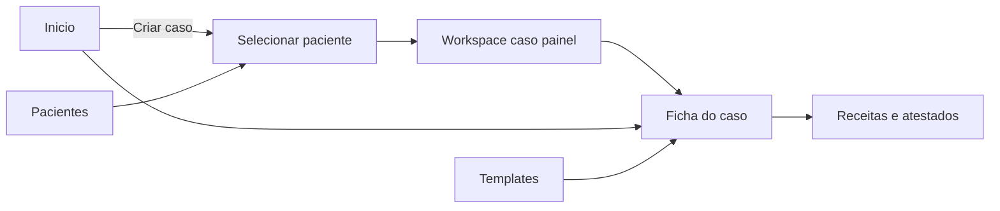

# PRD — Dashboard FALAPED (estado atual no repositório)

**Versão:** 1.0 (inventário) · **Data:** 28/03/2026 · **Status:** rascunho de documentação  
**Premissa:** este documento descreve apenas o que existe no código do dashboard **acessível pelo painel web**. **Não** descreve fluxos de atendimento por aplicativo de mensagens ou vinculação de números externos (telas como `app/dashboard/link-whatsapp/` existem no app, mas ficam **fora do escopo** deste PRD).

**Fontes no repositório:** layout e shell em `app/dashboard/layout.tsx`; navegação em `components/app-sidebar.tsx`; áreas em `app/dashboard/**` e componentes em `components/dashboard/**`.

---

## 1. Visão e contexto

O dashboard é a área autenticada onde o médico pediatra gerencia **casos (atendimentos)**, **pacientes**, **templates** de documentos, **receitas** e **atestados**, além de **discussões** livres com o assistente e o **perfil** da conta. A página **Início** consolida indicadores e atalhos. A experiência segue App Router do Next.js, Server Components para dados e componentes client onde há interação.

---

## 2. Problema e oportunidade

**N/A (documento de inventário).** Objetivo deste PRD é registrar **o que o produto já oferece** no painel para alinhar stakeholders e backlog, não propor nova solução.

---

## 3. Objetivos e métricas de sucesso

| Objetivo | Como verificar |
|----------|----------------|
| Cobertura do inventário | Cada seção principal da sidebar possui descrição de telas e capacidades principais |
| Rastreabilidade | Referência a rotas/pastas reais do repositório |

---

## 4. Personas / atores

- **Pediatra autenticado:** único ator do escopo; acesso a todos os dados vinculados ao seu `profile` / conta.

---

## 5. Escopo

**Dentro do escopo (painel):**

- Início com resumo operacional
- Casos: lista, detalhe, criação a partir de paciente, workspace de atendimento no painel
- Pacientes: lista, cadastro, ficha
- Templates de relatório e de receita (CRUD/listagem conforme implementado)
- Receitas e atestados: listagem e fluxo de criação (wizard)
- Discussões (chat livre sem paciente)
- Perfil: dados profissionais, tema, template padrão de relatório, logos, ações de conta

**Fora do escopo deste PRD:**

- Qualquer fluxo de atendimento ou configuração centrada em **aplicativo de mensagens** (incluindo páginas de vínculo de número)
- Autenticação pública (login/callback) além da menção de redirecionamento quando não há sessão

---

## 6. Requisitos funcionais (estado atual)

**RF-01 — Autenticação e shell**  
O sistema deve exigir sessão válida para rotas sob `/dashboard`; sem perfil, redirecionar ao login. O layout deve renderizar sidebar colapsável, área de conteúdo e menu do usuário no rodapé da sidebar.

**RF-02 — Navegação principal**  
A sidebar deve agrupar: Principal (Início); Atendimentos (Casos, Discussões, Pacientes); Templates (relatório, receita); Serviços (Atestados, Receitas).

**RF-03 — Início**  
Deve exibir: card do **caso ativo** (se houver) com paciente, responsável, telefone, linha do tempo, contagem de mensagens, estado do relatório, pendência do assistente quando existir, resumo de contexto para casos conduzidos pelo painel quando exibível; empty state quando não há caso ativo com CTA para criar caso e ver histórico; **números da conta** (pacientes, casos totais/encerrados, receitas emitidas, atestados emitidos); tabela dos **últimos casos encerrados** (até cinco) com link para a ficha.

**RF-04 — Casos — lista**  
Deve listar casos do perfil com toolbar (busca/filtros conforme `components/dashboard/cases/cases-toolbar.tsx` / tabela).

**RF-05 — Casos — novo pelo painel**  
A rota `/dashboard/cases/select-patient` deve permitir escolher paciente (busca, ordenação, confirmações) e criar caso do painel via Server Action, com pré-checagens.

**RF-06 — Casos — workspace do painel**  
A rota `/dashboard/cases/new/[caseId]` deve ser o espaço de **atendimento no painel** (conversa com assistente / continuidade do caso criado no dashboard).

**RF-07 — Casos — detalhe**  
A ficha `/dashboard/cases/[id]` deve exibir cabeçalho, faixa de comando (modo leitura se encerrado; para caso ativo originado no painel, CTA para “Ver Workspace”; para outras origens, cartão informativo neutro no código atual), ações rápidas (ex.: gerar relatório com IA quando elegível, links para nova receita/atestado com `caseId`/`patientId`), estado do caso (timeline, resumo clínico quando aplicável), **editor/visão de relatório do caso** amarrado ao template do perfil ou padrão, e documentos do caso (atestados e receitas vinculados).

**RF-08 — Relatório do caso**  
Deve respeitar template (seções normalizadas), regras de elegibilidade para geração (mensagens, template, relatórios existentes — ver `lib/case-report-generate-eligibility.ts`), e permitir fluxo de geração via ação do servidor onde implementado.

**RF-09 — Pacientes**  
Listagem com toolbar; cadastro em `/dashboard/patients/new`; ficha em `/dashboard/patients/[id]` com visão clínica, timeline, formulário de edição conforme componentes em `components/dashboard/patients/`.

**RF-10 — Templates de relatório**  
Listagem em `/dashboard/report-templates`; criar em `/new`; editar em `/[id]`; fluxo **Gerar com IA** em `/gerar-com-ia`; associação ao perfil como template padrão (select no Perfil).

**RF-11 — Templates de receita**  
Área dedicada em `/dashboard/prescription-templates` (listagem/gerenciamento conforme implementação).

**RF-12 — Receitas**  
Listagem global em `/dashboard/prescriptions`; criação via wizard em `/dashboard/prescriptions/new` (com suporte a `caseId`/`patientId` por query quando aplicável).

**RF-13 — Atestados**  
Listagem em `/dashboard/medical-certificates`; criação via wizard em `/dashboard/medical-certificates/new`.

**RF-14 — Discussões**  
Listagem e detalhe de conversas livres com o Falaped, sem vínculo a paciente (`/dashboard/discussions`).

**RF-15 — Perfil**  
Edição de dados (nome, email, CRM, RQE, redes, site, localização padrão estado/cidade), seleção de template de relatório padrão, upload/remoção de logos, tema claro/escuro/sistema, status da conta (valores pagamento/bloqueio conforme UI), exclusão de conta e outras ações expostas em `app/dashboard/profile/profile-content.tsx`.

**RF-16 — Menu do usuário**  
Dropdown com Perfil, Sair; itens adicionais existentes no código que não pertencem a este escopo não são detalhados aqui.

---

## 7. Requisitos não funcionais (observados / implícitos no stack)

- **Segurança:** dados escopados ao usuário autenticado; operações via Server Actions e módulos Supabase (`modules/`).
- **UX:** padrão Shadcn/Tailwind, textos em PT-BR na UI.
- **Performance:** Suspense/`loading.tsx` em várias rotas para estados de carregamento.

---

## 8. Fluxos e estados (narrativa — apenas painel)

- **Caso ativo único:** a UI do início comunica que há no máximo um caso ativo por vez.
- **Caso encerrado:** ficha em modo leitura; histórico e relatório permanecem acessíveis.
- **Elegibilidade de relatório:** geração pode estar desabilitada conforme regras (sem mensagens, sem template, etc.) com feedback por tooltip/toast.

---

## 9. Dados e integrações

- **Persistência:** Supabase (tabelas de casos, mensagens, pacientes, relatórios, templates, receitas, atestados, discussões, perfil — alinhamento em `docs/tipagens/modelagem/` quando necessário).
- **Integrações no escopo deste PRD:** geração de relatório com IA, armazenamento/download de PDFs onde implementado (ações e módulos de domínio).
- **Integrações fora do escopo:** canais externos de mensagem (não detalhados).

---

## 10. User stories e critérios de aceite (espelho do que já existe)

| ID | História | Critérios de aceite (alto nível) |
|----|----------|----------------------------------|
| US-01 | Como pediatra, quero ver um resumo na Início para retomar o caso ativo e ver métricas. | Caso ativo exibido com atalho para ficha; contadores corretos; últimos encerrados com link Abrir. |
| US-02 | Como pediatra, quero listar e abrir casos para consultar histórico e documentos. | Lista carrega casos do usuário; navegação para `/dashboard/cases/[id]`. |
| US-03 | Como pediatra, quero iniciar um caso pelo painel escolhendo um paciente. | Fluxo em select-patient cria caso e leva ao workspace ou feedback de erro claro. |
| US-04 | Como pediatra, quero continuar o atendimento no workspace do painel. | Rota `cases/new/[caseId]` funcional para caso do painel. |
| US-05 | Como pediatra, quero gerenciar pacientes e abrir a ficha. | CRUD/listagem/detalhe conforme rotas patients. |
| US-06 | Como pediatra, quero configurar templates de relatório e usá-los na ficha do caso. | CRUD de templates; seleção no perfil; relatório na ficha usa template resolvido. |
| US-07 | Como pediatra, quero emitir receitas e atestados vinculados ao caso quando aplicável. | Wizards e listagens; links rápidos na ficha com query params. |
| US-08 | Como pediatra, quero conversas livres sem paciente. | Discussões lista/detalhe operacional. |
| US-09 | Como pediatra, quero ajustar perfil, tema e template padrão. | Perfil persiste alterações e reflete na experiência de relatórios. |

---

## 11. Priorização

**N/A** para inventário. Todas as US acima descrevem capacidades **já presentes**; ordem de evolução futura fica para backlog separado.

---

## 12. Riscos, gargalos e premissas

- **Premissa:** descrição baseada no código atual; comportamento em produção depende de dados e RLS no Supabase.
- **Risco:** telas dedicadas a vínculo de número (fora do escopo deste PRD) mantêm copy específica do canal; o restante do dashboard usa termos neutros (“outro canal”, “concluir configuração da conta”) onde antes havia menção explícita ao canal de mensagens.
- **Gargalo:** elegibilidade e mensagens do relatório dependem de haver conteúdo conversacional registrado — impacta geração automática.

---

## 13. Plano de rollout

**N/A** — documentação de produto existente.

---

## 14. Perguntas em aberto

- Unificar copy da aplicação para alinhar ao escopo “somente painel” onde ainda houver referências a canais externos?
- Definir se a página de vínculo externo permanece no menu ou é reorganizada (decisão de produto, não coberta aqui).

---

## Revisão com stakeholders

Use este arquivo como base para validar completude (telas e fluxos) versus roadmap. Atualize versão/data após feedback.
