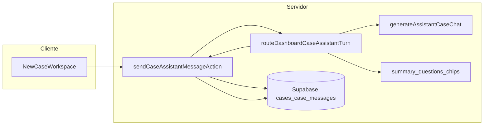

# PRD — Dashboard: Novo caso (workspace + assistente Falaped)

**Tipo:** documento **as-built** derivado dos commits da branch `feature/dashboard-criar-caso-workspace`  
**Base Git:** merge-base com `main` → `5d369ce` (18 commits)  
**Versão do documento:** 1.0  
**Data:** 2026-03-23  

**Documentos relacionados:** [chat-falaped-novo-caso.md](./chat-falaped-novo-caso.md), [transcricao-audio-novo-caso.md](./transcricao-audio-novo-caso.md)

---

## 1. Visão e contexto

O pediatra passa a iniciar atendimentos pelo painel em um fluxo **Novo caso**: escolhe um paciente, abre um **workspace** em tela cheia com conversa assistida pelo **Falaped**, pode **digitar** ou **gravar áudio** (transcrito no servidor), e interage com **atalhos (chips)** alinhados a intenções do assistente. Tudo persiste em **`case_messages`**, o mesmo canal usado pelo WhatsApp/bot, com distinção de origem do caso em **`cases.origin`**.

**Persona:** médico pediatra autenticado, com perfil **paid** e telefone WhatsApp validado no perfil (requisito para Groq e para `user_phone` dos casos).

**Problema / oportunidade:** o fluxo de novo caso no dashboard precisava de núcleo produtivo (chat + contexto do paciente + persistência) sem conflitar com a regra de **um caso ativo por telefone** quando a origem é WhatsApp.

**Objetivos implementados:**

| Objetivo | Implementação |
|----------|----------------|
| Caso dedicado ao painel | `cases.origin = 'dashboard'` |
| Histórico unificado | Mensagens em `case_messages` (user/assistant) |
| Sem encerrar caso WhatsApp ativo por engano | Bloqueio + redirect/toast para abrir o caso WhatsApp |
| Assistente com contexto longo | Truncagem + resumo rolante `dashboard_chat_context_summary` |
| Produto seguro para MVP | Gates por intent, confirmação para encerrar, relatório só com conversa mínima |

**Fora de escopo (implícito no código atual):**

- Streaming de tokens (SSE) na UI.
- Envio automático ao Falaped ao concluir transcrição (o texto vai para o composer; envio é explícito).
- Anexo de arquivos: botão de clipe existe na UI mas não integra envio ao thread (reset do input).

---

## 2. Backend

### 2.1 Dados e migrações

1. **`cases.origin`** (`whatsapp` | `dashboard`, default `whatsapp`): distingue caso criado pelo bot/canal WhatsApp de caso criado pelo fluxo Novo caso no app.  
   - Migração: `supabase/migrations/20260322153000_cases_origin_case_assistant_messages.sql`

2. **`case_assistant_messages` (removida):** migração inicial criou tabela separada; evolução unificou o thread em **`case_messages`**.  
   - Remoção: `supabase/migrations/20260322210000_drop_case_assistant_messages.sql`

3. **`cases.dashboard_chat_context_summary`:** texto com resumo rolante das mensagens mais antigas omitidas da janela enviada ao modelo.  
   - Migração: `supabase/migrations/20260322220000_cases_dashboard_chat_context_summary.sql`

### 2.2 Regras de negócio — casos

| Função | Arquivo | Comportamento |
|--------|---------|----------------|
| `ensureDashboardCase` | `modules/cases/ensure-dashboard-case.ts` | Garante ou reutiliza caso ativo `dashboard` para o `user_phone` do perfil. Se existir caso ativo com `origin = 'whatsapp'`, retorna `whatsapp_active` com `activeCaseId` (não cria conflito). |
| `createDashboardCaseWithPatient` | `modules/cases/create-dashboard-case-with-patient.ts` | Valida paciente por `profile_id`. Lista casos ativos do telefone: bloqueia se WhatsApp ativo; se houver `dashboard` ativo, **encerra** todos os ativos `dashboard` e insere novo caso com `patient_id`. Semeia primeira mensagem assistente com `DASHBOARD_NEW_CASE_GREETING` (`lib/constants.ts`). |
| `hasActiveDashboardCaseForPhone` | `modules/cases/has-active-dashboard-case-for-phone.ts` | Usado no **precheck** antes de criar outro caso pelo painel. |
| `getCaseRowForProfile` | `modules/cases/get-case-row-for-profile.ts` | Leitura de `cases` com checagem de posse via `profile_id`. |
| `setCasePatientId` / helpers | `modules/cases/*` | Associação de paciente ao caso no workspace. |

### 2.3 Mensagens

| Função | Arquivo |
|--------|---------|
| `insertCaseMessage` | `modules/case-messages/insert-case-message.ts` |
| `listCaseMessagesByCaseId` | `modules/case-messages/list-case-messages-by-case-id.ts` |
| `listCaseMessagesByCaseIdForProfile` | idem — valida caso do perfil antes de listar |

### 2.4 Autenticação e escopo de perfil

- `getAuthenticatedUser` estendido para suportar fluxo **profile-scoped** do dashboard (`modules/supabase/get-authenticated-user.ts`).
- Pacientes carregados por perfil: `getPatientsByProfileId`, `getPatientById` com validação de posse.

### 2.5 Server Actions (resumo)

| Action | Responsabilidade principal |
|--------|----------------------------|
| `createDashboardCaseWithPatientAction` | Cria caso + greeting; trata `whatsapp_active`, `unpaid`, `no_phone`. |
| `precheckNewDashboardCaseAction` | `actions/cases/precheck-new-dashboard-case.ts` — indica se criar novo caso **fechará** um dashboard ativo (`willClosePriorActiveDashboardCases`). |
| `sendCaseAssistantMessageAction` | `actions/cases/send-case-assistant-message.ts` — validação, paid, insert user, truncagem/resumo, `routeDashboardCaseAssistantTurn`, pós-processos relatório/encerramento, insert assistant. |
| `transcribeNewCaseAudioAction` | `actions/cases/transcribe-new-case-audio.ts` — valida arquivo, chama `transcribeAudioFile`. |
| `suggestCaseChatChipsAction` | `actions/cases/suggest-case-chat-chips.ts` — chips via Groq ou fallback. |
| `linkPatientToCaseAction` | `actions/cases/link-patient-to-case.ts` — associa paciente no header do workspace. |
| `generateCaseReportAction` / `updateCaseStatusAction` | Integrados a partir de `sendCaseAssistantMessageAction` para intent de relatório e encerramento confirmado. |

### 2.6 Fluxo de dados (referência)

---

## 3. IA — Gates, intents, chat, transcrição, chips

### 3.1 Roteador e intents

**Arquivo:** `modules/dashboard-assistant/route-case-assistant-turn.ts`

**Intents:** `GENERATE_REPORT` | `CLOSE_CASE` | `SUGGEST_GUARDIAN_QUESTIONS` | `CALCULATE_BMI` | `SUMMARY` | `QUESTION` | `REVIEW_ANTHROPOMETRIC_REFERENCE` | `REVIEW_GUARDIAN_ALERT` | `CHAT`

**Detecção:** normalização de texto (PT-BR, lowercase, NFD sem acentos, espaços colapsados) + **substring** nas mensagens do usuário:

| Padrão (normalizado) | Intent |
|----------------------|--------|
| contém `gerar relatorio` | `GENERATE_REPORT` |
| contém `encerrar caso` ou `fechar caso` | `CLOSE_CASE` |
| contém `sugerir perguntas` | `SUGGEST_GUARDIAN_QUESTIONS` |
| contém `imc` | `CALCULATE_BMI` |
| contém `resumir principais pontos` | `SUMMARY` |
| mensagem com pergunta explícita (`?`, “como”, “qual”, “estratégia”, etc.) **ou classificada por IA** como dúvida assistiva | `QUESTION` |
| mensagem de dictado com novos peso/altura divergentes do cadastro | `REVIEW_ANTHROPOMETRIC_REFERENCE` |
| mensagem com alerta explícito do responsável (ex.: engasgos, caixa alta) | `REVIEW_GUARDIAN_ALERT` |
| demais | `CHAT` |

**Tipos de mensagem persistidos (`messageKind`):** Relatório, Encerramento, Cálculo, Resumo, Conversa, Aviso — prefixados no conteúdo como `Tipo: …` em `formatAssistantPersistedContent` na action.

### 3.2 Gates (`gateFailed` e afins)

| Situação | Código / efeito |
|----------|------------------|
| Encerramento sem confirmação após aviso do assistente | `close_confirmation_missing` |
| “Sugerir perguntas” sem mensagens user suficientes **antes** do pedido | `guardian_suggestions_min_turns` — mínimo = `DASHBOARD_GUARDIAN_SUGGESTIONS_MIN_PRIOR_USER_MESSAGES` (= `CASE_CHAT_CHIP_AI_MIN_USER_TURNS - 1`, hoje **4**) |
| LLM não retornou perguntas | `guardian_suggestions_empty` |
| Erro ao gerar perguntas | `guardian_suggestions_failed` |
| IMC sem peso/altura parseáveis | `bmi_missing_data` |
| Resumo sem itens ancorados no histórico | `summary_no_grounded_items` |
| Relatório sem conversa clínica mínima | `report_min_data_missing` (na action, `hasMinimumConversationForReport`) |
| Falha ao gerar relatório | `report_generation_failed` |
| Falha ao encerrar caso após confirmação | `close_case_failed` |

**Encerramento em duas etapas:** primeiro turno `CLOSE_CASE` responde pedindo confirmação (“Confirmação necessária…”). Estados seguintes detectam última mensagem assistente pendente (`pendingCloseConfirmation`). Confirmação aceita se mensagem normalizada for exatamente `confirmar encerramento` ou contiver `sim, encerrar` / `pode encerrar`. Com `closeConfirmed`, a **action** chama `updateCaseStatusAction(caseId, "closed")`.

**Relatório:** o roteador pode responder de forma informativa sobre o botão; a **action**, ao detectar `intent === "GENERATE_REPORT"`, aplica gate de dados mínimos e chama `generateCaseReportAction` ou retorna erro amigável.

### 3.3 Chat principal (Groq)

- **Arquivo:** `modules/groq/assistant-case-chat.ts`
- **Modelo:** `GROQ_ASSISTANT_MODEL` (default `qwen/qwen3-32b`)
- **Saída:** JSON validado com Zod: `reply`, `insights[]`
- **System prompt:** PT-BR, anti-alucinação (só usar histórico + contexto do paciente), limites clínicos, formato JSON obrigatório
- **Entradas extras:** `patientContext`, `conversationSummary`, `omitOlderMessagesNotice`

### 3.4 Janela de contexto e resumo

Constantes em `lib/constants.ts`:

- `ASSISTANT_CASE_CHAT_MAX_HISTORY_MESSAGES` = 48  
- `ASSISTANT_CASE_CHAT_MAX_HISTORY_CHARS` = 14_000  
- `ASSISTANT_CASE_CHAT_SUMMARY_MIN_DROPPED_MESSAGES` = 4 — ao truncar, se mensagens descartadas ≥ 4, tenta `extendDashboardCaseContextSummary` e persiste em `dashboard_chat_context_summary`

**Arquivos:** `truncate-assistant-case-chat-history.ts`, `summarize-dashboard-case-context.ts`, `update-case-dashboard-chat-context-summary.ts`

### 3.5 Outras chamadas LLM

| Módulo | Uso |
|--------|-----|
| `generate-grounded-case-summary.ts` | Intent `SUMMARY` |
| `generate-guardian-follow-up-questions.ts` | Intent `SUGGEST_GUARDIAN_QUESTIONS` (após gate de turnos) |
| `generate-case-chat-chip-suggestions.ts` | Sugestões de chips no composer |

### 3.6 Transcrição (STT)

- **Arquivo:** `modules/groq/transcribe-audio.ts`
- **Modelo:** `whisper-large-v3`, `language: pt`, `temperature: 0`, `verbose_json` com segmentos
- **Prompt curto:** vocabulário pediátrico PT-BR + “transcrever fielmente”
- **Qualidade:** `ok` | `empty` | `suspicious` (heurística com `no_speech_prob` médio > 0.5)

**Action:** valida MIME/extensões, tamanho ≤ `GROQ_TRANSCRIPTION_MAX_FILE_BYTES` (25 MB), perfil paid, `GROQ_API_KEY`; mapeia 429 para mensagem de serviço ocupado.

### 3.7 Chips (produto + IA)

**Arquivo:** `lib/dashboard-case-chat-chips.ts`

- Labels que, como **mensagem inteira** normalizada, disparam apenas comandos (ex.: `gerar relatorio deste caso`, `encerrar caso`, `resumir principais pontos do atendimento`, `sugerir perguntas para o responsavel`, `confirmar encerramento`) — alinhadas ao router.
- `CASE_CHAT_CHIP_AI_MIN_USER_TURNS` = **5**: só depois disso o cliente pede sugestões via `suggestCaseChatChipsAction` + Groq; abaixo disso usa `getFallbackCaseChatChips`.
- `computeHasSubstantiveUserContent`: mensagem user ≥ `CASE_CHAT_SUBSTANTIVE_USER_MESSAGE_MIN_CHARS` (16) e não é só comando — controla `filterChipsForSubstantiveContent` (esconde chips de relatório/resumo até haver texto clínico).
- Debounce UI: `CASE_CHAT_CHIP_SUGGESTION_DEBOUNCE_MS` (650 ms).

---

## 4. Front-end

### 4.1 Rotas

| Rota | Comportamento |
|------|----------------|
| `/dashboard/cases/new` | Redireciona para `/dashboard/cases/select-patient` |
| `/dashboard/cases/select-patient` | Página “Novo caso”: lista pacientes, precheck, diálogo de substituição de caso dashboard ativo |
| `/dashboard/cases/new/[caseId]` | Server Component: exige caso existente, `origin === 'dashboard'`, `status === 'active'`; senão redirect/`notFound` |

### 4.2 Componentes principais

- **`SelectPatientWorkspace`** (`components/dashboard/cases/select-patient-workspace.tsx`): `precheckNewDashboardCaseAction` → se `willClosePriorActiveDashboardCases`, `AlertDialog` “Caso ativo no painel”; `createDashboardCaseWithPatientAction` → navega para `/dashboard/cases/new/{caseId}`; toast com ação “Abrir caso” se WhatsApp ativo.
- **`NewCaseWorkspace`** (`components/dashboard/cases/new-case-workspace.tsx`): header (paciente, fechar), thread (`ChatMessageList` + empty state), indicador de digitação, footer com chips + textarea + enviar + mic + clipe.
- **Dados registrados na resposta do assistente:** agora aparecem via **ícone de informação** no canto da mensagem, abrindo popover com dados estruturados e botões de **Confirmar / Não confirmar** para itens pendentes (ex.: IMC).
- **Loading de resposta do assistente:** removida a copy detalhada “A resposta está em processamento…”, mantendo apenas estado visual de “Falaped está respondendo…”.
- **`CasePatientPickerSheet`**: troca/associação de paciente.

### 4.3 Áudio e pós-processamento

- **`hooks/use-audio-recorder.ts`:** gravação, pausa, limite de duração alinhado a `NEW_CASE_TRANSCRIPTION_MAX_DURATION_SECONDS` (600 s em constants).
- **`lib/voice-recorder-postprocess.ts`:** pipeline para MP3 via **lamejs** carregado de `public/vendor/lame.min.js` (scripts `copy-lame-vendor.cjs` / `verify-lamejs.cjs`).
- Transcrição: FormData campo `audio` → `transcribeNewCaseAudioAction`; texto concatenado ao draft com `appendTranscribedText`; highlight opcional no textarea.

### 4.4 Sidebar / navegação

Commits associados: melhoria de navegação e alinhamento com o fluxo Novo caso (itens de menu e destinos). O workspace em si trata **fechar** via `handleCloseRequest` no header.

---

## 5. Design e UX/UI

### 5.1 Princípios aplicados

- **Content-first:** thread central, fundo sutil (grid pontilhado), borda leve no container.
- **PT-BR** em cópias, toasts e `aria-label`.
- **Uma ação primária clara:** enviar mensagem ao Falaped; chips como atalhos secundários.

### 5.2 Composer e conversa

- **Enter** envia; **Shift+Enter** quebra linha; ignora Enter durante composição IME (`isComposing`).
- **Indicador “digitando”:** `AssistantTypingIndicator` exibido enquanto `assistantSending`; duração mínima visível `ASSISTANT_TYPING_MIN_DISPLAY_MS` (3000 ms) após resposta rápida da API para evitar “piscar”.
- **Otimistic UI:** mensagem user aparece antes da resposta; em erro, reverte e restaura draft.
- **Confirmação de ações (relatório, encerramento, atestado, receita):** enquanto a última mensagem do assistente expõe botões Confirmar/Cancelar, o **textarea, chips, mic e enviar** ficam desabilitados até o médico decidir; os botões da mensagem permanecem ativos (`bypassPendingActionGate` no envio disparado por eles).
- **Transcrição:** badge “Transcrevendo…” com `aria-live="polite"` e `aria-busy`.

### 5.3 Chips

- Área de sugestões com `aria-live="polite"` e `aria-busy` quando carregando; desabilita clique durante loading ou gravação/transcrição.

### 5.4 Fechar / descartar

- Se **há** mensagens do usuário no thread: navega direto para `/dashboard/cases`.
- Se **não há:** `AlertDialog` — título “Descartar consulta sem mensagens?”; “Salvar e continuar” (cancel) vs “Descartar e sair” (link para listagem).

### 5.5 Acessibilidade

- `aria-label` no textarea (“Mensagem para o Falaped”), botões Enviar/Mic/Anexo.
- `role="alert"` para erro de STT com botão “Tentar novamente”.
- `section` com `aria-label="Área do novo caso"`.

---

## 6. Rastreabilidade — commits → capacidade

Ordem cronológica (antigo → novo), base `5d369ce..HEAD`:

| SHA | Resumo |
|-----|--------|
| `2a7f550` | Fluxo Criar Caso, workspace, ajustes de layout |
| `99d7021` | Gravação de áudio + lamejs |
| `ace901b` | Transcrição de áudio para novo caso |
| `78cf4aa` | Migrations: `origin`, tabela assistente (posteriormente substituída por `case_messages` unificado) |
| `e35e7c7` | Docs: modelagem + PRD conversa novo caso |
| `2dc08db` | Skills Cursor: supabase/dashboard alinhados |
| `3d9f882` | Parsers e constants (caso + assistente) |
| `afc79f8` | `getAuthenticatedUser` profile-scoped |
| `98b50ef` | Queries pacientes por perfil (fluxo caso) |
| `b108cb9` | Mensagens, helpers caso dashboard, vínculo paciente |
| `e94ae79` | Groq: assistente + janela + resumo |
| `056dc00` | Server actions: caso dashboard + chat Falaped |
| `6dacbd9` | Rotas novo caso, workspace, picker, UI chat |
| `b230b9b` | Precheck caso dashboard ativo antes de criar novo |
| `f0fdcc7` | Indicador estilo WhatsApp + Enter para enviar |
| `71729bb` | Sidebar/navegação + diálogo ao fechar |
| `a06747b` | Layout full-height da página `[caseId]` |
| `30c97e2` | Roteamento assistente, chips contextuais, perguntas ao responsável (IA) |

---

## 7. Riscos e débitos técnicos

1. **Intents por substring:** frases do pediatra que contenham trechos acidentais (ex. “IMC” em outro contexto) podem disparar rota errada; mitigação futura poderia ser classificador LLM ou lista de frases exatas para chips.
2. **Dependência Groq:** indisponibilidade ou 429 afeta chat, chips, transcrição e alguns fluxos; mensagens já estão em PT-BR na action.
3. **RLS / segurança:** paridade com políticas existentes em `cases` / `case_messages`; revisar documentação de segurança quando políticas mudarem.
4. **Anexo (clipe):** UX presente sem pipeline de upload para o caso — risco de expectativa do usuário; documentar como placeholder até implementação.

---

## 8. Constantes de produto (referência rápida)

| Constante | Valor (snapshot) |
|-----------|------------------|
| `NEW_CASE_TRANSCRIPTION_MAX_DURATION_SECONDS` | 600 |
| `GROQ_TRANSCRIPTION_MAX_FILE_BYTES` | 25 × 1024 × 1024 |
| `ASSISTANT_CASE_CHAT_MAX_HISTORY_MESSAGES` | 48 |
| `ASSISTANT_CASE_CHAT_MAX_HISTORY_CHARS` | 14_000 |
| `ASSISTANT_CASE_CHAT_SUMMARY_MIN_DROPPED_MESSAGES` | 4 |
| `ASSISTANT_TYPING_MIN_DISPLAY_MS` | 3000 |
| `CASE_CHAT_SUBSTANTIVE_USER_MESSAGE_MIN_CHARS` | 16 |
| `CASE_CHAT_CHIP_AI_MIN_USER_TURNS` | 5 |
| `DASHBOARD_GUARDIAN_SUGGESTIONS_MIN_PRIOR_USER_MESSAGES` | 4 |
| `CASE_CHAT_CHIP_MAX_PER_RESPONSE` | 4 |

---

*Fim do documento.*
