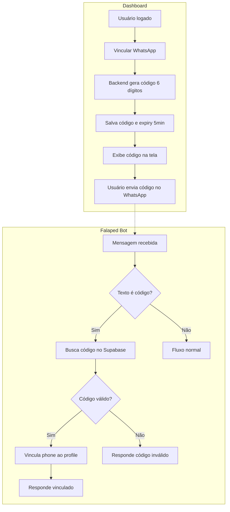
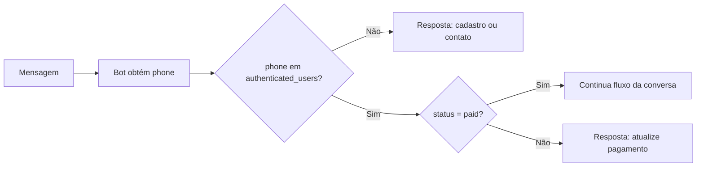

# Relatório: Autenticação em dois lados (Dashboard + Bot)

Documento que consolida o contexto, decisões e fluxos discutidos sobre a tabela `authenticated_users`, o vínculo com `profiles`, o comportamento do falaped-bot e a vinculação de WhatsApp por código.

---

## 1. Contexto inicial

**Solicitação:** Na tabela `authenticated_users` era necessário criar (ou garantir) uma referência do id do profile a uma chave nessa tabela, para que, ao logar com o usuário, o sistema já trouxesse a referência de autenticação do usuário no sistema.

**Situação do schema:** A coluna `profile_id` (FK → profiles) **já existe** na tabela `authenticated_users`. Não foi necessária migration para criá-la.

---

## 2. Contexto do falaped-bot

O **falaped-bot** é um bot no WhatsApp que usa o Supabase como memória e para verificações.

**Fluxo atual no bot quando um usuário manda mensagem:**

1. O bot verifica se o **número de telefone** que enviou a mensagem está cadastrado na tabela **authenticated_users**.
2. Se estiver, verifica o **status**:
   - **paid** → usuário apto para continuar o fluxo de conversa com o Falaped.
   - **blocked** ou **unpaid** → o bot envia mensagem pedindo para atualizar pagamento ou entrar em contato.

**Sobre a tabela authenticated_users:** Ela possui vários campos que, do ponto de vista de modelo, deveriam estar em `profiles`. Decidiu-se **migrar** esses dados para `profiles` e deixar em `authenticated_users` apenas o necessário para autenticação e para o contrato do bot (phone + status). Ver seção 3.

---

## 3. Forma final das tabelas `profiles` e `authenticated_users`

Após as mudanças, os dados de perfil do médico ficam em **profiles**; **authenticated_users** fica enxuta, só com o que o bot e o fluxo de autenticação precisam.

### 3.1 Tabela `authenticated_users` (após)

Fica apenas com:

| Coluna       | Tipo | Observação                              |
|--------------|------|------------------------------------------|
| `id`         | uuid | PK                                       |
| `phone`      | text | not null, unique (busca do bot)          |
| `status`     | text | paid / unpaid / blocked                  |
| `profile_id` | uuid | not null, FK → profiles                  |

Ou seja: **só id, phone, status e profile_id.** O bot continua consultando por `phone` e `status`; o dashboard resolve a conta por `profile_id`.

### 3.2 Tabela `profiles` (após)

Concentra todos os dados do médico/perfil. O que hoje está em `authenticated_users` (exceto id, phone, status, profile_id) passa para `profiles`:

| Coluna                | Tipo      | Observação |
|-----------------------|-----------|------------|
| `id`                  | uuid      | PK         |
| `auth_user_id`        | uuid      | FK → auth.users |
| `phone`               | text      | unique     |
| `first_name`          | text      | ex-nome (full_name vira FirstName + Surname) |
| `surname`             | text      | sobrenome  |
| `email`               | text      | nullable   |
| `crm`                 | text      | nullable   |
| `logo_url_full`       | text      | nullable   |
| `logo_url_short`      | text      | nullable   |
| `rqe`                 | text      | nullable   |
| `social_media_handle` | text      | nullable   |
| `website`             | text      | nullable   |
| `report_template_id`  | uuid      | nullable, FK → report_templates |
| `created_at`          | timestamptz | |
| `updated_at`          | timestamptz | |

**Migração de full_name:** o campo `full_name` é substituído por **`first_name`** e **`surname`** em `profiles`. No signup/trigger, preencher a partir do que hoje vai em `full_name` (ex.: split no primeiro espaço).

### 3.3 Resumo da migração

- **De authenticated_users para profiles:** full_name → first_name + surname, email, crm, logo_url_full, logo_url_short, rqe, social_media_handle, website, report_template_id.
- **Permanece em authenticated_users:** id, phone, status, profile_id.
- **Bot:** segue usando só `authenticated_users` (phone + status); não precisa ler `profiles`.
- **Dashboard:** lê perfil em `profiles` (por profile_id ou auth → profile); lê status em `authenticated_users`.

---

## 4. Abordagem mínima (bot quase sem mudança)

- **Bot continua igual:** contrato do bot permanece “dado um telefone, consultar `authenticated_users` e usar o status”. Nenhuma mudança obrigatória no falaped-bot; a tabela continua tendo `phone` e `status`.
- **Dashboard:** resolve a sessão por profile (auth → profile → authenticated_users por `profile_id`); lê status em `authenticated_users` e demais dados em `profiles`.
- **Signup:** o trigger que cria o profile preenche `profiles` (first_name, surname, email, phone, etc.) e cria uma linha em `authenticated_users` com `profile_id`, `phone`, `status = 'unpaid'`.

---

## 5. Limitação: autenticar o bot só pelo número

Foi levantada a questão: **autenticar o bot somente pelo número de telefone é adequado?**

**Problemas de “só pelo telefone”:**

- Qualquer um que use aquele número no WhatsApp é tratado como o dono da conta.
- Não há prova de que “quem manda mensagem” é o mesmo “quem tem a conta no dashboard”.
- O vínculo número ↔ conta é implícito (só existe porque cadastraram aquele número), não confirmado.

**Conclusão:** A forma mais adequada é ter **uma única identidade (conta)** e **dois canais** (dashboard e WhatsApp) ligados a ela de forma controlada. Ou seja: o bot continua identificando por **número**, mas esse número deve ser **vinculado/verificado** à conta (dashboard) de forma explícita, em vez de confiar em “quem quer que use esse número”.

---

## 6. Vinculação por código (Dashboard + Bot)

Foi adotada a ideia de **vinculação por código**:

- **Dashboard:** usuário logado acessa algo como “Vincular WhatsApp” → o backend gera um **código (ex.: 6 dígitos)**, salva em tabela/cache com `profile_id` (ou `authenticated_user_id`) e tempo de expiração (ex.: 5 min) → o código é **exibido na tela**.
- **Usuário:** envia esse **código** em uma mensagem no WhatsApp para o Falaped.
- **Bot:** ao receber a mensagem, obtém o **phone** e o texto. Se o texto for um código (ex.: 6 dígitos), o bot consulta no Supabase se existe um código igual, não expirado e não usado, associado a um `profile_id`. Se existir, o bot **vincula** aquele `phone` ao `profile_id` (atualizando `authenticated_users` ou tabela equivalente), marca o código como usado e responde algo como “WhatsApp vinculado”. Caso contrário, responde “Código inválido ou expirado”. Se o texto não for um código, segue o fluxo normal da conversa.

Assim, o **app/dashboard** gera e exibe o código; o **bot** valida o código e persiste a vinculação no Supabase.

**Diagrama do fluxo (Dashboard + validação do código no bot):**

---

## 7. Validação no bot após a vinculação

Depois da vinculação, o bot **continua validando** da mesma forma em toda mensagem:

1. Usuário envia mensagem.
2. Bot obtém o **phone** (número de quem enviou).
3. Bot consulta a tabela **authenticated_users** por esse **phone**.
4. **Se não encontrar** → trata como não cadastrado (ex.: mensagem pedindo cadastro/contato).
5. **Se encontrar** → lê o **status**:
   - **paid** → segue o fluxo normal da conversa.
   - **unpaid** ou **blocked** → envia mensagem pedindo atualizar pagamento ou entrar em contato.

Ou seja: a vinculação **estabelece** qual número pertence a qual conta; a **validação em toda mensagem** continua sendo: phone → authenticated_users → status → paid = continua, caso contrário = mensagem de pagamento/contato.

**Diagrama da validação no bot (a cada mensagem):**

---

## 8. Resumo das decisões

| Tema | Decisão |
|------|--------|
| **profile_id em authenticated_users** | Já existe; não foi necessária migration para criá-lo. |
| **Impacto no bot** | Nenhuma mudança obrigatória: bot continua consultando por **phone** e **status** em `authenticated_users`. |
| **Campos em authenticated_users vs profiles** | Migrar para `profiles`: full_name → first_name + surname, email, crm, logos, rqe, social_media_handle, website, report_template_id. `authenticated_users` fica só com id, phone, status, profile_id. |
| **Segurança do “só pelo telefone”** | Melhorar com **vinculação explícita**: código gerado no dashboard e validado no bot, associando phone ao profile/account. |
| **Pós-vinculação** | Bot segue validando: phone → authenticated_users → status; paid = continua fluxo, unpaid/blocked = mensagem de pagamento/contato. |

---

*Documento gerado a partir da conversa sobre autenticação em dois lados (dashboard + falaped-bot).*
